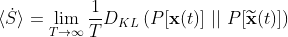
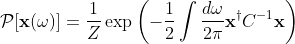
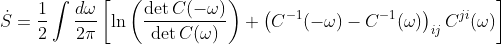

# Spectral estimate of entropy production rates via entropy production factor
This repository contains code written in Python3 to calculate entropy production rates from times series data of random variables and fields. The paper describing the technique described here can be found [here](https://arxiv.org/abs/1911.10696).

### Theory
We solve for the entropy production exhibited by a time series of *N* ≥ 2 variables over a time *T*, **x**(*t*), using the information theoretic measure of entropy production introduced in [Kawai, Parrondo, and Van den Broeck, PRL 2007](https://link.aps.org/doi/10.1103/PhysRevLett.98.080602),



where *D*<sub>KL</sub> is the Kullback-Leibler divergence, or relative entropy, between the probability functional of observing a forward path, *P*[**x**(*t*)], and the probability functional of observing its reverse path. We assume *P*[**x**(*t*)] to be Gaussian,



where *C*<sub>ij</sub>(*ω*) = < *x*<sub>i</sub>(*ω*) *x*<sub>j</sub>(-*ω*)> is the frequency space covariance matrix for the variables *x*<sub>i</sub>(*t*) and *Z* = exp(*T*/2 ∫ d*ω*/2π  ln [det **C**(*ω*)] is a normalization constant. The same is done for the reverse path. Solving for *D*<sub>KL</sub> and taking the relevant limit, the entropy production rate is given by



This expression exists not only for random variables **x**(*t*), but also for random fields, **φ**(**r**, *t*), where **r** is a *d*-dimensional vector. In this case, the expressions given above are virtually unchanged, but have additional integrals over the spatial wavevectors, **q**.

### Code
The code to calculate the entropy production rate is written as a module called `freqent` (i.e. **freq**uency **ent**ropy) for easy use and modularity. After cloning the repository, create a virtual environment with the specifications set in the two `yml` files found in the repository. One has requirments for Macs and the other for Linux. The code has not been tested on Windows machines. The main requirements are the packages `numpy`, `scipy`, and `numba`, and `matplotlib` for plotting. Using [`conda`](https://docs.conda.io/en/latest/), one can use the following commands to create and activate the virtual environment
```bash
conda env create -f epf_paper_osx.yml
conda activate epf_paper
```
Once the virtual environment has been activated, use the following commands to install this package into the virtual environment:
```bash
cd /path/to/this/repo
pip install -e .
```
The `-e` option installs the package in "editable" mode, so any changes to the package will be imported without needing to reinstall the package.

`freqent` has two submodules, `freqent.freqent` for use with random variables and `freqent.freqentn` for random fields (similar to `numpy.fft.fft` vs. `numpy.fft.fftn`). Once installed, the methods can be called from within a script, Jupyter notebook, or iPython terminal by importing the relevant module as you would any other:

```python
import freqent.freqent as fe
import freqent.freqentn as fen
```

The main functions to use are `fe.entropy()` and `fen.entropy()`. See their documentation in `freqent/freqent.py` and `freqent/freqentn.py`. Below we provide a quick example that shows how to use `fe.entropy()` to calculate the entropy production rate of a simulated equilibrium process: a Brownian particle trapped in a harmonic potential. This script takes a few seconds to run.

```python
import numpy as np
import matplotlib.pyplot as plt
import matplotlib as mpl
import freqent.freqent as fe

# plotting preferences
mpl.rcParams['font.size'] = 12
mpl.rcParams['axes.linewidth'] = 2
mpl.rcParams['xtick.major.width'] = 2
mpl.rcParams['ytick.major.width'] = 2
mpl.rcParams['ytick.minor.width'] = 2
mpl.rcParams['xtick.direction'] = 'in'
mpl.rcParams['ytick.direction'] = 'in'

# set a random seed for reproducibility
np.random.seed(7499927)

# simulate two dimensional overdamped Brownian motion in harmonic trap
# time rescaled by spring constant, and diffusion constant and drag coefficient set to 1
t_final = 100
dt = 0.01
t = np.arange(0, t_final, dt)
k = 1  # set spring constant
random_force = np.random.randn(len(t), 2)  # create list of random forces
position = np.zeros((len(t), 2))
for ind in range(1, len(t)):
    xi = random_force[ind - 1]
    pos = position[ind - 1]
    force = -pos
    new_pos = pos + dt * (force + np.sqrt(2 / dt) * xi)
    position[ind] = new_pos

# Calculate EPR. Theoretically should be zero
# data input to fe.entropy() assumes first dimension indexes over variables, not time
# we also smooth correlation functions with a gaussian of width 10*dw, where dw is the spacing
# in frequency space
epr, epf, w = fe.entropy(position.T, sample_spacing=dt,
                         sigma=10, return_epf=True)

fig, ax = plt.subplots(1, 2, figsize=(9, 4))
ax[0].plot(position[:, 0], position[:, 1])
ax[0].set(xlabel='x', ylabel='y', title='simulation output')

# plot EPF, which should look like some noise
ax[1].plot(w, epf, label=r'$\hat{{\dot{{S}}}} =${0:0.2f}'.format(epr))
ax[1].set(xlabel=r'$\omega$', ylabel=r'$\hat{\mathcal{E}}$', xlim=[-100, 100])
ax[1].legend()

plt.tight_layout()
plt.show()
```


There are several simulations present in the `freqent/tests/` folder that output data ready for input into the relevant `entropy()` functions. Examples on how to run each simulation is in a `README` file in each of simulation's folder.
